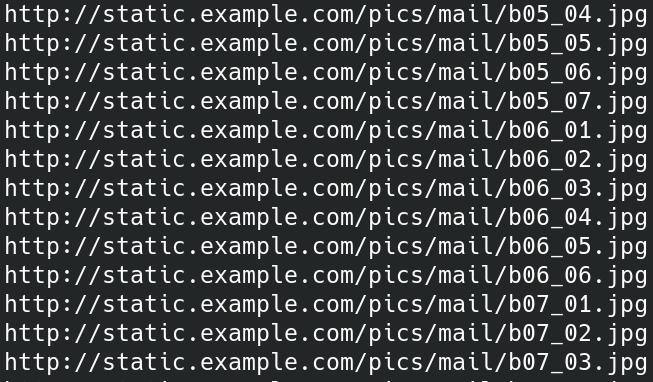

# dsscanner  
Recursively download and parse DS_Store files on websites

Licensed under GPLv3  

dsstore.py from https://github.com/gehaxelt/Python-dsstore  
Licensed under MIT license  

## Usage  
dsscanner.py \<URL> \<LOGFILE>   
For example:
> dsscanner.py http://example.com example-files.txt  

## Results  
Tool produces log file with urls of found content  
  
